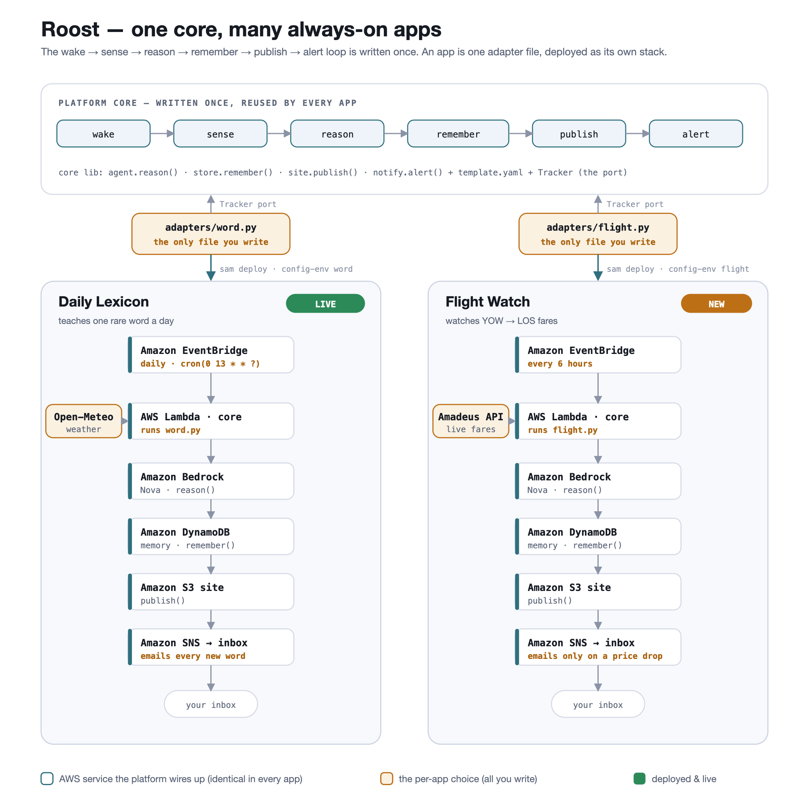

<!--
FINAL ARTICLE - copy the content below into the AWS Builder Center editor.
The live URL and repo link are already filled in. Before you publish:
  1. Upload docs/architecture.png where the diagram is referenced.
  2. Add a screenshot of your real page + email (swap the Petrichor sample for
     your own first word, e.g. Sonder, if you like).
Everything else is ready as-is. Title and tag are exact per the challenge terms.
-->

**Title:** Weekend Creative Agent Challenge: Daily Lexicon

**Tag:** #agents

## Vision and what it does

I read a lot, and I kept meeting words I loved and then forgetting them by the
next chapter. The friction was never the looking-up, it was the remembering, and
the small daily effort of going and finding a new one. So I built Daily Lexicon,
an always-on agent that teaches me one new word every day without my ever opening
an app.

Every morning, before I am awake, the agent wakes on its own, conjures a single
uncommon and genuinely beautiful English word, and themes it to the date and to
Ottawa's weather that day. It presents the word with its pronunciation,
definition, etymology, an example sentence, and a tiny original poem that uses
the word and echoes the mood of the day. By the time I have poured my coffee, the
word is already waiting for me, both on a web page and in my inbox. The best tool
is the one you never have to open, so this one opens itself.

Here is a real morning's output:

> **Petrichor** /ˈpɛtrɪkɔːr/ · noun
> The earthy scent produced when rain falls on dry soil.
> *Origin:* Greek *petra* (stone) and *ichor*, the fluid said to run in the veins
> of the gods.
> *In a sentence:* "The first storm of August broke, and petrichor rose from the
> warm pavement like a memory."
>
> *Warm stone remembers every drought,*
> *then breathes its petrichor aloud,*
> *a summer psalm the clouds let out.*
>
> — for a warm, rainy summer Saturday

## How I built it

The decision that makes this an agent rather than a cron job that calls a model
once is memory. A daily word generator with no memory repeats itself and never
grows. So before it creates anything, the Lambda reads every word it has already
taught out of DynamoDB and hands the model that list with one instruction: never
reuse these, and drift into new territory over time. That single feedback loop is
what turns a random word picker into something that behaves like it is paying
attention across days.

The second decision was to make the agent feel like it knows what day it is. Each
run pulls the date, the season, and Ottawa's current weather from a free API, so
a warm rainy Saturday produces a different word and mood than a cold clear Monday.
The weather is woven into the poem, not just stamped on top.

I also kept the whole thing dependency-free. The Lambda uses only boto3, which is
already in the runtime, and the Python standard library, so `sam build` never
reaches for pip and the build is trivially reproducible.

The main challenge was getting reliable, renderable output out of the model. A
page and an email need real structure, not prose, so I ask Bedrock to reply as
strict JSON and then treat that reply as untrusted. The agent parses it, tolerates
the model wrapping JSON in a code fence or a sentence, validates that every field
the page depends on is present, and regenerates if anything is missing. Nothing
half-formed ever reaches the page. That guard, plus adaptive retries on throttling
and a once-a-day idempotency check so a retry never emails me twice, is most of
what took this from "works on my machine" to something I would leave running
unattended for months.

## AWS services used and architecture overview

| Service | Role |
|---|---|
| Amazon EventBridge | Daily schedule that wakes the agent, no server ever idles |
| AWS Lambda (Python 3.12) | The orchestrator: remember, sense, create, publish |
| Amazon Bedrock (Nova Lite) | Chooses the word and writes the verse |
| Amazon DynamoDB | The agent's memory, for non-repetition and evolution |
| Amazon S3 | Hosts the static page waiting for me each morning |
| Amazon SNS | Emails me the word wherever I am |
| AWS SAM | Infrastructure as code for the whole stack |

One Lambda is the entire orchestration layer. It reads its memory, senses the day,
makes one Bedrock call, and produces two outputs, a web page and an email. Keeping
it a single function instead of a Step Functions workflow was a deliberate
weekend-scope decision. The sequence is linear enough that a state machine would
have added ceremony without adding reliability.

## What I learned

Building this reframed what the word "agent" means to me. I went in expecting the
interesting part to be the model call, and it was almost the opposite. Bedrock's
Converse API made the generation itself nearly boring, in the best way, one clean
call that I could swap between models without touching anything around it. The
design surface that actually mattered was the memory loop. An agent that reads its
own past output before it acts is a genuinely different system from one that does
not, even though the difference in code is a few lines and one DynamoDB table. It
is the difference between a thing that produces and a thing that develops.

The second lesson was that trusting a language model's output is the wrong default
for anything that publishes on its own. Treating the reply as untrusted, parsing
defensively, validating the fields, and regenerating on a bad response, is what
lets an unattended agent run without quietly shipping something broken one morning
while I am asleep.

And on a practical note, I came away convinced that small single-purpose agents
should stay dependency-free when they can. Reaching for urllib instead of an
external HTTP library cost me a little code polish and bought a build that is fast
to iterate on and reproducible every time. For something meant to run untouched
for months, that trade was worth it.

## Link to app or repo

- **Live page:** http://weekend-agent-sitebucket-u45d4xwbqfej.s3-website-us-east-1.amazonaws.com
- **Code:** https://github.com/coolchigi/AWS-Builder-s-Weekend-Challenge

The repository includes the full SAM template, the source, a test suite, CI, and
setup instructions.
